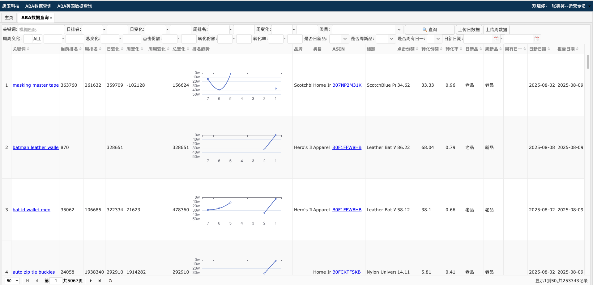

# 亚马逊关键词分析工具

## 目录
- [依赖框架](#依赖框架)
- [账号信息](#账号信息)
- [部署流程](#部署流程)
- [常用命令](#常用命令)
- [生产环境配置](#生产环境配置)

## 依赖框架
- [FastAPI-Amis-Admin](https://docs.amis.work/zh/)
- [uv](https://hellowac.github.io/uv-zh-cn/)

## 账号信息

### 对标网站
- **网站地址**: [https://8b164h4196.vicp.fun/](https://8b164h4196.vicp.fun/)
- **账号**: zhangxiaoxiao
- **密码**: 1


### 紫鸟浏览器
- **公司名**: 郑州采参堂电子商务有限公司
- **用户名**: 开发
- **密码**: KF112233@

## 部署流程

### 环境准备
```bash
# 安装Docker和Docker Compose
curl -fsSL https://get.docker.com -o get-docker.sh
sudo sh get-docker.sh
sudo usermod -aG docker $USER
```

### 项目部署
```bash
# 克隆项目
git clone <project-repo>
cd amazon-search-analysis

# 给部署脚本执行权限
chmod +x deploy.sh

# 执行部署
./deploy.sh
```

### 访问系统
```
地址: http://localhost:8000
账号: admin / pwd123
```

## 常用命令

```bash
# 查看服务状态
docker-compose ps

# 查看日志
docker-compose logs -f app

# 重启服务
docker-compose restart

# 停止服务
docker-compose down

# 备份数据库
docker-compose exec db pg_dump -U postgres amazon_db > backup.sql
```

## 生产环境配置

- 修改.env中的密码和密钥
- 调整docker-compose.yml中的资源限制
- 配置反向代理(Nginx)
- 设置SSL证书